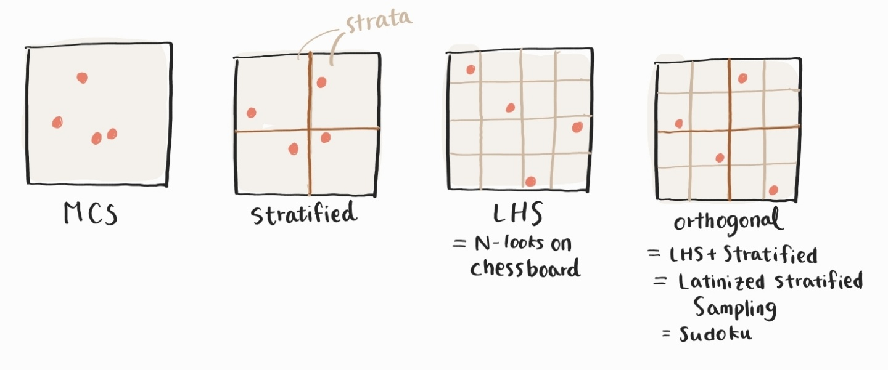

### Let us start with this integration.

where $$h(x)$$ is an arbitrary function and $$f(x)$$ is the probability density function of $$x$$. Depending on how you set $$h(x)$$, $$S$$ can be mean, variance, or even reliability (failure probability). 

We can think of two numerical approaches to perform the integration.

* Riemann sum: $$S = \sum^n_{i=1}h(x_i)\Delta V_i$$ 
* Monte Carlo integration: $$S = \frac{1}{n}\sum^n_{i=1}h(x_i)$$

When $$x$$ is 1 dimensional, their convergence rates are ...

* MCS $$ \propto \frac{1}{n^{0.5}} $$ (regardless of dimension)
* Riemann sum $$ \propto \frac{1}{n^{1/d}}$$ ($$p$$: dimension of $$x$$)

So the Riemann sum converges faster than MCS for 1D, they are the same for 2D, and the Riemann sum converges slower for higher dimension problems. Can we combine both to get (almost) always a higher convergence rate? Yes, and, in fact, **we are already achieving this through Latin Hyper Cube sampling (LHS)**.

### What is Latin Hypercube Sampling (LHS)? 

[Ref](https://www.maxvalue.com/tip029.htm): "Conventional Monte Carlo Sampling (MCS) generates each sample independently using a random number generator ranging 0-1. If you sample 100 realizations, you will find gaps and clusters. LHS is an anti-clustering technique. The system divides each dimension of the domain into 0.01 interval layers to get exactly one sample each layer in every 100 trials."

### Benefits of LHS

LHS gives you unbiased estimates on statistics and it reduces the standard error in the estimation of $$ S $$.

* [Ref](https://old.analytica.com/blog/latin-hypercube-vs.-monte-carlo-sampling) : "Published theoretical results for the univariate case show that the sampling error of Monte Carlo goes down as $$O( 1/\sqrt{N} )$$, [2], whereas the sampling error for LHS is $$O( 1/N )$$, quadratically faster, for almost all distributions and statistics in common use [3], [5], [7]. In other words, if you need $$N$$ samples for a desired accuracy using LHS, you'll need $$N^2$$ samples for the same accuracy using MC."

There are two ways of understanding how LHS achieves the efficiency.

 * LHS excludes the variability in the main effect

	Recall the convergence rate
	* MCS $$ \propto \frac{1}{n^{0.5}} $$ (regardless of dimension)
	* Riemann sum $$ \propto \frac{1}{n} $$ (for $$p$$-dimensional case,  $$ \propto \frac{1}{n^{1/d}}$$)
	* Stratified sampling (Randomized Riemann sum) $$ \propto \frac{1}{n^{1.5}}$$ [ref](https://dl.acm.org/doi/pdf/10.1145/237170.237265) [ref (Theorem 5.5)????](https://lup.lub.lu.se/luur/download?func=downloadFile&recordOId=9056983&fileOId=9058877)

	To be added

 * Control variate theory

	To be added

### Drawbacks of LHS

* Some LHS are biased [Ref](https://wiki.analytica.com/images/c/c1/Ugbook_image_markup0418.pdf): "Very rarely, median Latin hypercube can produce incorrect results, specifically when the model has a periodic function with a period similar to the size of the equiprobable intervals. In such cases, you should use random Latin hypercube or simple Monte Carlo. If your model has no periodic function of this kind, you do not need to worry about the reliability of median Latin hypercube sampling". 
* Precision of results and confidence interval cannot be calculated
* Difficult to add new samples
* May require more computation time and memory than MC depending on algorithm?
 [an objection](https://old.analytica.com/blog/latin-hypercube-vs.-monte-carlo-sampling#7)
https://www.maxvalue.com/tip029.htm
* Cannot introduce copula? [an objection](https://old.analytica.com/blog/latin-hypercube-vs.-monte-carlo-sampling#7)
https://www.maxvalue.com/tip029.htm
* Read more on [The pros and cons of Latin Hypercube sampling](https://www.linkedin.com/pulse/20140708131747-483951-the-pros-and-cons-of-latin-hypercube-sampling)

