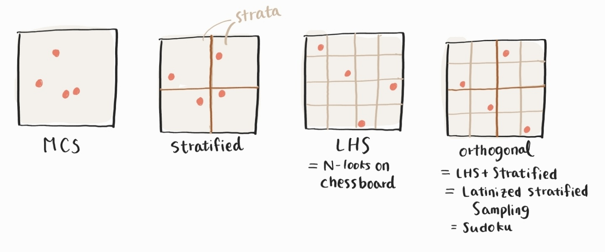

### What is Latin Hypercube Sampling (LHS)?

Conventional Monte Carlo Sampling (MCS) generates each sample independently using a random number generator ranging 0-1. If you sample 100 realizations, you will find gaps and clusters. LHS is an anti-clustering technique. The system divides each dimension of the domain into 0.01 interval layers to get exactly one sample each layer in every 100 trials.

### Benefits of LHS

LHS gives you unbiased estimates on statistics, but it reduces the standard error.

### How is LHS gaining efficiency? How much efficiency do we expect?
There are two ways of understanding LHS

#### Excluding variability in the main effect

#### By control variate approach

References
https://www.maxvalue.com/tip029.htm

### Drawbacks of LHS